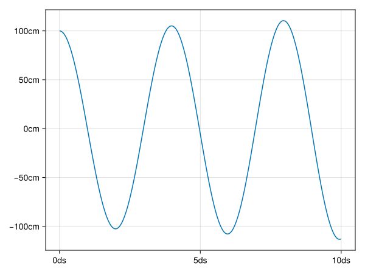

# Example

It cannot be helped that this example will seem a bit contrived.

We're modelling the movement of a spring. It can be useful to put some common definitions in a separate module.

```julia
#| file: examples/spring.jl

using ModuleMixins
using CairoMakie
using Unitful

module Common
    abstract type AbstractInput end
    abstract type AbstractState end

    function initial_state(input::AbstractInput)
        error("Can't construct from AbstractInput")
    end

    export AbstractInput, AbstractState, initial_state
end

<<example-time>>
<<example-spring>>
<<example-run>>
```

The model has input parameters and a mutable state.
We'll have a time component:

```julia
#| id: example-time

@compose module Time
    using Unitful
    using ..Common

    @kwdef struct Input <: AbstractInput
        t_step::typeof(1.0u"s")
        t_end::typeof(1.0u"s")
    end

    mutable struct State <: AbstractState
        time::typeof(1.0u"s")
    end

    function step!(input::AbstractInput, state::AbstractState)
        state.time += input.t_step
    end

    function run(model, input::AbstractInput)
        s = model.initial_state(input)
        Channel() do ch
            while s.time < input.t_end
                model.step!(input, s)
                put!(ch, deepcopy(s))
            end
        end
    end
end
```

Note that the `run` function is generic.
And a component for the spring.

```julia
#| id: example-spring

@compose module Spring
    @mixin Time
    using ..Common
    using Unitful

    @kwdef struct Input <: AbstractInput
        spring_constant::typeof(1.0u"s^-2")
        initial_position::typeof(1.0u"m")
    end

    mutable struct State <: AbstractState
        position::typeof(1.0u"m")
        velocity::typeof(1.0u"m/s")
    end

    function step!(input::AbstractInput, state::AbstractState)
        delta_v = -input.spring_constant * state.position
        state.position += state.velocity * input.t_step
        state.velocity += delta_v * input.t_step
    end
end
```

Now we may compose these using `@mixin`:

```julia
#| id: example-run

@compose module Model
    @mixin Time, Spring
    using ..Common
    using Unitful

    function step!(input::Input, state::State)
        Spring.step!(input, state)
        Time.step!(input, state)
    end

    function initial_state(input::Input)
        return State(0.0u"s", input.initial_position, 0.0u"m/s")
    end
end
```

And see the result.

```julia
#| id: example-run

function plot_result()
    input = Model.Input(
        t_step = 0.001u"s",
        t_end = 1.0u"s",
        spring_constant = 250.0u"s^-2",
        initial_position = 1.0u"m",
    )

    output = Time.run(Model, input) |> collect
    times = [f.time for f in output]
    pos = [f.position for f in output]

    fig = Figure()
    ax = Axis(fig[1, 1])
    lines!(ax, times, pos)
    save("docs/src/fig/plot.svg", fig)
end

plot_result()
```


